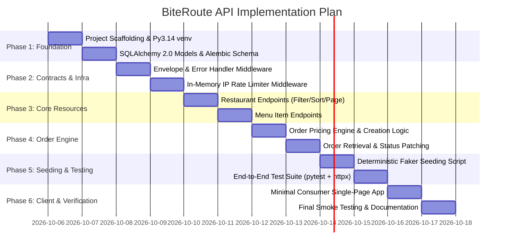

# Product Requirements Document (PRD)

## Project: BiteRoute API (Food Delivery Marketplace)
**Context:**  "Build and Serve a Consumable REST API"  
**Document Version:** 1.1.0  
**Target Runtime:** Python 3.14 / FastAPI / PostgreSQL / Uvicorn  

---

## 1. Product Summary & Goal

BiteRoute API is a backend RESTful service simulating a food delivery marketplace. It provides a standardized, consumable, and robust API layer for discovering restaurants, browsing categorized menus, calculating itemized order pricing, and placing delivery orders.

The primary objective is to deliver a production-grade API contract that external consumers (web apps, mobile frontends, partner aggregators) can reliably integrate with. Key product goals include:
- Predictable, uniform response envelopes for both success and error states.
- Defensive validation with strict parameter clamping and non-sequential identifiers.
- Comprehensive querying (limit/offset pagination, multi-field filtering, multi-field sorting).
- Protection via IP-based rate limiting with standard compliance headers.
- Repeatable, realistic sample datasets generated via deterministic seeding.

---

## 2. Non-Goals (Scope Boundaries)

The following areas are explicitly excluded from this iteration:
- **Authentication & Authorization:** No user login, JWT tokens, API keys, session management, or role-based access control (RBAC). All endpoints are publicly consumable.
- **Admin Portals:** No back-office administrative dashboards, GUI management tools, or content-management panels.
- **Design Systems & UI Frameworks:** No CSS frameworks (Tailwind, Bootstrap), UI component libraries, or complex state management libraries.
- **Consumer Landing Page:** No marketing pages, SEO blogs, hero sections, or commercial web copy.
- **Payment Processing:** No third-party payment gateway integrations (e.g., Stripe, Adyen, PayPal). Payment is assumed settled upon order placement.
- **Live Geolocation Tracking:** No WebSockets, Server-Sent Events (SSE), or live courier GPS tracking.

---

## 3. Domain Entities & Database Schema

### 3.1 Core Architecture Rules
1. **Identifier Strategy:** Every table utilizes UUIDv4 primary keys generated either via PostgreSQL (`gen_random_uuid()`) or application-side (`uuid.uuid4()`). No sequential auto-incrementing integers are exposed.
2. **Currency Storage:** All monetary values are represented as positive 64-bit integers in **cents** (`price_cents`, `subtotal_cents`, `delivery_fee_cents`, `tax_cents`, `total_cents`) to prevent IEEE-754 floating-point inaccuracies. $12.50 is stored as `1250`.
3. **Timestamps:** Every table contains `created_at` and `updated_at` stored in UTC with timezone (`TIMESTAMPTZ`).

---

### 3.2 Entity-Relationship Details

```
+------------------------------------+          +------------------------------------+
|            restaurants             |          |             menu_items             |
+------------------------------------+          +------------------------------------+
| id (UUID, PK)                      |<----+    | id (UUID, PK)                      |
| name (VARCHAR(255))                |     |    | restaurant_id (UUID, FK)           |----+
| slug (VARCHAR(255), UNIQUE)        |     +---o| name (VARCHAR(255))                |    |
| description (TEXT)                 |     |    | description (TEXT)                 |    |
| cuisine_type (VARCHAR(64))         |     |    | category (VARCHAR(64))             |    |
| price_tier (SMALLINT, 1-4)         |     |    | price_cents (INTEGER)              |    |
| rating (NUMERIC(3,2))              |     |    | is_available (BOOLEAN)             |    |
| is_active (BOOLEAN)                |     |    | image_url (VARCHAR(1024))          |    |
| address_street (VARCHAR(255))      |     |    | created_at (TIMESTAMPTZ)           |    |
| address_city (VARCHAR(100))        |     |    | updated_at (TIMESTAMPTZ)           |    |
| address_postal_code (VARCHAR(20))  |     |    +------------------------------------+    |
| delivery_fee_cents (INTEGER)       |     |                                              |
| estimated_delivery_minutes (INT)   |     |                                              |
| created_at (TIMESTAMPTZ)           |     |                                              |
| updated_at (TIMESTAMPTZ)           |     |                                              |
+------------------------------------+     |                                              |
                  ^                        |                                              |
                  |                        |                                              |
                  |                        |                                              |
+------------------------------------+     |    +------------------------------------+    |
|               orders               |     |    |            order_items             |    |
+------------------------------------+     |    +------------------------------------+    |
| id (UUID, PK)                      |     |    | id (UUID, PK)                      |    |
| restaurant_id (UUID, FK)           +-----+    | order_id (UUID, FK)                |<---+
| customer_name (VARCHAR(128))       |          | menu_item_id (UUID, FK)            |----+
| customer_email (VARCHAR(255))      |          | item_name (VARCHAR(255))           |
| customer_phone (VARCHAR(32))       |          | unit_price_cents (INTEGER)         |
| delivery_address (TEXT)            |          | quantity (INTEGER)                 |
| status (VARCHAR(32))               |          | line_total_cents (INTEGER)         |
| subtotal_cents (INTEGER)           |          | created_at (TIMESTAMPTZ)           |
| delivery_fee_cents (INTEGER)       |          +------------------------------------+
| tax_cents (INTEGER)                |
| total_cents (INTEGER)              |
| special_instructions (TEXT)        |
| created_at (TIMESTAMPTZ)           |
| updated_at (TIMESTAMPTZ)           |
+------------------------------------+
```

---

### 3.3 Database Table Definitions (DDL)

```sql
-- gen_random_uuid() is built into PostgreSQL 13+; no extension required.

-- 1. Restaurants
CREATE TABLE restaurants (
    id UUID PRIMARY KEY DEFAULT gen_random_uuid(),
    name VARCHAR(255) NOT NULL,
    slug VARCHAR(255) NOT NULL UNIQUE,
    description TEXT,
    cuisine_type VARCHAR(64) NOT NULL,
    price_tier SMALLINT NOT NULL CHECK (price_tier BETWEEN 1 AND 4),
    rating NUMERIC(3, 2) NOT NULL DEFAULT 0.00 CHECK (rating BETWEEN 0.00 AND 5.00),
    is_active BOOLEAN NOT NULL DEFAULT TRUE,
    address_street VARCHAR(255) NOT NULL,
    address_city VARCHAR(100) NOT NULL,
    address_postal_code VARCHAR(20) NOT NULL,
    delivery_fee_cents INTEGER NOT NULL DEFAULT 0 CHECK (delivery_fee_cents >= 0),
    estimated_delivery_minutes SMALLINT NOT NULL DEFAULT 30 CHECK (estimated_delivery_minutes > 0),
    created_at TIMESTAMPTZ NOT NULL DEFAULT NOW(),
    updated_at TIMESTAMPTZ NOT NULL DEFAULT NOW()
);

CREATE INDEX idx_restaurants_cuisine ON restaurants(cuisine_type);
CREATE INDEX idx_restaurants_price_tier ON restaurants(price_tier);
CREATE INDEX idx_restaurants_active ON restaurants(is_active);

-- 2. Menu Items
CREATE TABLE menu_items (
    id UUID PRIMARY KEY DEFAULT gen_random_uuid(),
    restaurant_id UUID NOT NULL REFERENCES restaurants(id) ON DELETE CASCADE,
    name VARCHAR(255) NOT NULL,
    description TEXT,
    category VARCHAR(64) NOT NULL,
    price_cents INTEGER NOT NULL CHECK (price_cents >= 0),
    is_available BOOLEAN NOT NULL DEFAULT TRUE,
    image_url VARCHAR(1024),
    created_at TIMESTAMPTZ NOT NULL DEFAULT NOW(),
    updated_at TIMESTAMPTZ NOT NULL DEFAULT NOW()
);

CREATE INDEX idx_menu_items_restaurant ON menu_items(restaurant_id);
CREATE INDEX idx_menu_items_category ON menu_items(restaurant_id, category);
CREATE INDEX idx_menu_items_availability ON menu_items(restaurant_id, is_available);

-- 3. Orders
CREATE TABLE orders (
    id UUID PRIMARY KEY DEFAULT gen_random_uuid(),
    restaurant_id UUID NOT NULL REFERENCES restaurants(id) ON DELETE RESTRICT,
    customer_name VARCHAR(128) NOT NULL,
    customer_email VARCHAR(255) NOT NULL,
    customer_phone VARCHAR(32) NOT NULL,
    delivery_address TEXT NOT NULL,
    status VARCHAR(32) NOT NULL DEFAULT 'PENDING' CHECK (status IN ('PENDING', 'CONFIRMED', 'PREPARING', 'OUT_FOR_DELIVERY', 'DELIVERED', 'CANCELLED')),
    subtotal_cents INTEGER NOT NULL CHECK (subtotal_cents >= 0),
    delivery_fee_cents INTEGER NOT NULL CHECK (delivery_fee_cents >= 0),
    tax_cents INTEGER NOT NULL CHECK (tax_cents >= 0),
    total_cents INTEGER NOT NULL CHECK (total_cents >= 0),
    special_instructions TEXT,
    created_at TIMESTAMPTZ NOT NULL DEFAULT NOW(),
    updated_at TIMESTAMPTZ NOT NULL DEFAULT NOW()
);

CREATE INDEX idx_orders_restaurant ON orders(restaurant_id);
CREATE INDEX idx_orders_status ON orders(status);
CREATE INDEX idx_orders_created ON orders(created_at DESC);

-- 4. Order Items
CREATE TABLE order_items (
    id UUID PRIMARY KEY DEFAULT gen_random_uuid(),
    order_id UUID NOT NULL REFERENCES orders(id) ON DELETE CASCADE,
    menu_item_id UUID NOT NULL REFERENCES menu_items(id) ON DELETE RESTRICT,
    item_name VARCHAR(255) NOT NULL,
    unit_price_cents INTEGER NOT NULL CHECK (unit_price_cents >= 0),
    quantity INTEGER NOT NULL CHECK (quantity > 0),
    line_total_cents INTEGER NOT NULL CHECK (line_total_cents >= 0),
    created_at TIMESTAMPTZ NOT NULL DEFAULT NOW()
);

CREATE INDEX idx_order_items_order ON order_items(order_id);
```

---

## 4. REST API Specification

### 4.1 Routing & Global Envelope Contracts

All application endpoints are prefixed with `/api/v1`.

#### Success Envelope — Collection (List)
```json
{
  "data": [
    {
      "id": "9b1deb4d-3b7d-4bad-9bdd-2b0d7b3dcb6d",
      "name": "Napoli Artisan Pizza",
      "slug": "napoli-artisan-pizza",
      "cuisine_type": "Italian",
      "price_tier": 2,
      "rating": 4.75,
      "is_active": true,
      "delivery_fee_cents": 299,
      "estimated_delivery_minutes": 25,
      "created_at": "2026-10-01T12:00:00Z",
      "updated_at": "2026-10-01T12:00:00Z"
    }
  ],
  "meta": {
    "total": 50,
    "limit": 20,
    "offset": 0,
    "hasMore": true
  }
}
```

#### Success Envelope — Single Resource
```json
{
  "data": {
    "id": "9b1deb4d-3b7d-4bad-9bdd-2b0d7b3dcb6d",
    "name": "Napoli Artisan Pizza",
    "slug": "napoli-artisan-pizza",
    "description": "Authentic wood-fired Neapolitan pizza and fresh pasta.",
    "cuisine_type": "Italian",
    "price_tier": 2,
    "rating": 4.75,
    "is_active": true,
    "address_street": "142 Commercial St",
    "address_city": "San Francisco",
    "address_postal_code": "94111",
    "delivery_fee_cents": 299,
    "estimated_delivery_minutes": 25,
    "created_at": "2026-10-01T12:00:00Z",
    "updated_at": "2026-10-01T12:00:00Z"
  }
}
```

#### Error Envelope
```json
{
  "error": {
    "code": "STATUS_CODE_NAME",
    "message": "Human readable detail"
  }
}
```

---

### 4.2 Endpoint Matrix

| Method | Path | Summary | Query / Body Parameters | Success Status |
|---|---|---|---|---|
| `GET` | `/api/v1/health` | Service liveness probe | None | `200 OK` |
| `GET` | `/api/v1/restaurants` | List restaurants (paginated, sorted, filtered) | `limit`, `offset`, `cuisine`, `price_tier`, `is_active`, `sort_by`, `sort_order` | `200 OK` |
| `GET` | `/api/v1/restaurants/{id}` | Retrieve restaurant detail | Path: `id` (UUID) | `200 OK` |
| `POST` | `/api/v1/restaurants` | Create restaurant | Body: Restaurant payload | `201 Created` |
| `GET` | `/api/v1/restaurants/{restaurant_id}/menu-items` | List menu items for restaurant | Path: `restaurant_id`, Query: `limit`, `offset`, `category`, `is_available`, `sort_by`, `sort_order` | `200 OK` |
| `POST` | `/api/v1/restaurants/{restaurant_id}/menu-items` | Create menu item under restaurant | Path: `restaurant_id`, Body: Menu Item payload | `201 Created` |
| `GET` | `/api/v1/menu-items/{id}` | Retrieve individual menu item | Path: `id` (UUID) | `200 OK` |
| `POST` | `/api/v1/orders` | Submit order (atomic calculation) | Body: Order placement payload | `201 Created` |
| `GET` | `/api/v1/orders/{id}` | Retrieve order with itemized breakdown | Path: `id` (UUID) | `200 OK` |
| `PATCH`| `/api/v1/orders/{id}/status` | Transition order status | Path: `id` (UUID), Body: `{"status": "CANCELLED"}` | `200 OK` |

---

### 4.3 Detailed Endpoint Contracts

#### 1. `GET /api/v1/health`
- **Response `200 OK`:**
  ```json
  {
    "data": {
      "status": "healthy",
      "timestamp": "2026-10-05T21:00:00Z",
      "version": "1.0.0"
    }
  }
  ```

#### 2. `GET /api/v1/restaurants`
- **Query Parameters:**
  - `limit`: Integer. Default `20`. Min `1`, Max `100`.
  - `offset`: Integer. Default `0`. Min `0`.
  - `cuisine`: String (optional). Filter by exact `cuisine_type` (case-insensitive).
  - `price_tier`: Integer (optional). Filter by `1`, `2`, `3`, or `4`.
  - `is_active`: Boolean (optional). Filter active status (`true`/`false`).
  - `sort_by`: String. Allowed: `name`, `rating`, `delivery_fee_cents`, `created_at`. Default: `created_at`.
  - `sort_order`: String. Allowed: `asc`, `desc`. Default: `desc`.

#### 3. `POST /api/v1/restaurants`
- **Request Body:**
  ```json
  {
    "name": "Taqueria Sonora",
    "description": "Sonoran style street tacos and burritos.",
    "cuisine_type": "Mexican",
    "price_tier": 1,
    "address_street": "789 Mission St",
    "address_city": "San Francisco",
    "address_postal_code": "94103",
    "delivery_fee_cents": 199,
    "estimated_delivery_minutes": 20
  }
  ```
- **Response `201 Created`:** Wrapped single resource envelope with generated `id`, `slug`, `rating: 0.00`, and timestamps.

#### 4. `GET /api/v1/restaurants/{restaurant_id}/menu-items`
- **Query Parameters:**
  - `limit`: Integer. Default `20`, Max `100`, Min `1`.
  - `offset`: Integer. Default `0`, Min `0`.
  - `category`: String (optional). Filter by category (e.g., `Appetizer`, `Tacos`, `Drinks`).
  - `is_available`: Boolean (optional). Default returns all unless specified.
  - `sort_by`: String. Allowed: `price_cents`, `name`, `created_at`. Default: `name`.
  - `sort_order`: String. Allowed: `asc`, `desc`. Default: `asc`.

#### 5. `POST /api/v1/orders`
- **Request Body:**
  ```json
  {
    "restaurant_id": "9b1deb4d-3b7d-4bad-9bdd-2b0d7b3dcb6d",
    "customer_name": "Jane Doe",
    "customer_email": "jane.doe@example.com",
    "customer_phone": "+1-415-555-0199",
    "delivery_address": "500 Howard St, Apt 4B, San Francisco, CA 94105",
    "special_instructions": "Leave at front desk with doorman.",
    "items": [
      {
        "menu_item_id": "4a2b1c8f-2a3b-4c5d-6e7f-8a9b0c1d2e3f",
        "quantity": 2
      },
      {
        "menu_item_id": "5b3c2d9e-3b4c-5d6e-7f8a-9b0c1d2e3f4a",
        "quantity": 1
      }
    ]
  }
  ```
- **Server-Side Pricing Engine Execution:**
  1. Verify `restaurant_id` exists (else `404 RESOURCE_NOT_FOUND`) and is active (else `400 RESTAURANT_NOT_ACCEPTING_ORDERS`).
  2. Load all matching `menu_item_id`s in a single query.
  3. Validate every item belongs to the given `restaurant_id`.
  4. Validate every item has `is_available = TRUE`.
  5. Calculate:
     - `subtotal_cents = SUM(menu_item.price_cents * quantity)`
     - `delivery_fee_cents = restaurant.delivery_fee_cents`
     - `tax_cents = ROUND(subtotal_cents * 0.0875)` (standard 8.75% tax rate)
     - `total_cents = subtotal_cents + delivery_fee_cents + tax_cents`
  6. Insert `orders` record and itemized `order_items` records in a single database transaction.
- **Response `201 Created`:**
  ```json
  {
    "data": {
      "id": "e6a0d2f1-628b-4a57-b087-9bbec8905b76",
      "restaurant_id": "9b1deb4d-3b7d-4bad-9bdd-2b0d7b3dcb6d",
      "customer_name": "Jane Doe",
      "customer_email": "jane.doe@example.com",
      "customer_phone": "+1-415-555-0199",
      "delivery_address": "500 Howard St, Apt 4B, San Francisco, CA 94105",
      "status": "PENDING",
      "subtotal_cents": 3400,
      "delivery_fee_cents": 299,
      "tax_cents": 298,
      "total_cents": 3997,
      "special_instructions": "Leave at front desk with doorman.",
      "created_at": "2026-10-05T21:05:00Z",
      "items": [
        {
          "id": "7c8d9e0f-1a2b-3c4d-5e6f-7a8b9c0d1e2f",
          "menu_item_id": "4a2b1c8f-2a3b-4c5d-6e7f-8a9b0c1d2e3f",
          "item_name": "Margherita Pizza",
          "unit_price_cents": 1450,
          "quantity": 2,
          "line_total_cents": 2900
        },
        {
          "id": "8d9e0f1a-2b3c-4d5e-6f7a-8b9c0d1e2f3a",
          "menu_item_id": "5b3c2d9e-3b4c-5d6e-7f8a-9b0c1d2e3f4a",
          "item_name": "Tiramisu",
          "unit_price_cents": 500,
          "quantity": 1,
          "line_total_cents": 500
        }
      ]
    }
  }
  ```

#### 6. `PATCH /api/v1/orders/{id}/status`
- **Request Body:** `{"status": "<TARGET_STATUS>"}` — must be one of the six order statuses (otherwise `422 UNPROCESSABLE_ENTITY`).
- **Allowed Transitions (all others, including same-status, return `400 ILLEGAL_STATUS_TRANSITION`):**

  | From | Allowed To |
  |---|---|
  | `PENDING` | `CONFIRMED`, `CANCELLED` |
  | `CONFIRMED` | `PREPARING`, `CANCELLED` |
  | `PREPARING` | `OUT_FOR_DELIVERY` |
  | `OUT_FOR_DELIVERY` | `DELIVERED` |
  | `DELIVERED` | *(terminal)* |
  | `CANCELLED` | *(terminal)* |

- **Response `200 OK`:** Wrapped single resource envelope containing the full updated order (same shape as `POST /api/v1/orders` response, with refreshed `status` and `updated_at`).

---

## 5. Validation & Edge Case Rules

The API employs strict, defensive validation rules across query parameters, path variables, and request payloads:

| Failure Scenario | HTTP Status | Error Code | Error Message Specification |
|---|---|---|---|
| `limit > 100` | `400 Bad Request` | `BAD_REQUEST` | `"Parameter 'limit' cannot exceed 100."` |
| `limit < 1` | `400 Bad Request` | `BAD_REQUEST` | `"Parameter 'limit' must be at least 1."` |
| `offset < 0` | `400 Bad Request` | `BAD_REQUEST` | `"Parameter 'offset' cannot be negative."` |
| Invalid `sort_by` field | `400 Bad Request` | `INVALID_SORT_FIELD` | `"Invalid sort field 'xyz'. Allowed fields: [<endpoint allowed fields>]."` — Restaurants: `[name, rating, delivery_fee_cents, created_at]`; Menu items: `[price_cents, name, created_at]`. |
| Invalid `sort_order` | `400 Bad Request` | `INVALID_SORT_ORDER` | `"Invalid sort order 'xyz'. Allowed values: [asc, desc]."` |
| Malformed UUID in path | `400 Bad Request` | `MALFORMED_IDENTIFIER` | `"Value '123' is not a valid UUIDv4 identifier."` |
| Resource not found | `404 Not Found` | `RESOURCE_NOT_FOUND` | `"<Entity> with id '<id>' was not found."` |
| Missing required body fields | `422 Unprocessable Entity` | `UNPROCESSABLE_ENTITY` | `"Missing required field: '<field_name>'."` |
| Empty items array in order | `422 Unprocessable Entity` | `UNPROCESSABLE_ENTITY` | `"Order must contain at least one item."` |
| Non-positive item quantity | `422 Unprocessable Entity` | `UNPROCESSABLE_ENTITY` | `"Quantity for item must be greater than 0."` |
| Cross-restaurant order items | `400 Bad Request` | `CROSS_RESTAURANT_CONFLICT` | `"Item '<menu_item_id>' does not belong to restaurant '<restaurant_id>'."` |
| Inactive / unavailable item | `400 Bad Request` | `ITEM_UNAVAILABLE` | `"Item '<item_name>' is currently unavailable for order."` |
| Order for inactive restaurant | `400 Bad Request` | `RESTAURANT_NOT_ACCEPTING_ORDERS` | `"Restaurant '<restaurant_id>' is not currently accepting orders."` |
| Illegal order state transition | `400 Bad Request` | `ILLEGAL_STATUS_TRANSITION` | `"Cannot transition order from 'DELIVERED' to 'CANCELLED'."` |

---

## 6. Rate Limiting Specification

### 6.1 Configuration & Mechanism
- **Scope:** In-memory, per-client IP address rate limiter implemented as FastAPI middleware.
- **Quota:** 100 requests per 60-second sliding/fixed window per IP.
- **Client IP Extraction:** Evaluates `X-Forwarded-For` first (taking the leftmost client address), falling back to `request.client.host`.
- **Exemptions:** `GET /api/v1/health` is exempt from rate limits to allow monitoring without penalty.

### 6.2 Standard HTTP Headers
Every API response includes compliance headers:
- `X-RateLimit-Limit`: `100`
- `X-RateLimit-Remaining`: Integer remaining requests in current window.
- `X-RateLimit-Reset`: UTC epoch timestamp (in seconds) when the window resets.

### 6.3 Exhaustion Response
When quota is exceeded, the server halts request processing immediately:
- **HTTP Status:** `429 Too Many Requests`
- **Response Header:** `Retry-After: <seconds_remaining>`
- **Response Body:**
  ```json
  {
    "error": {
      "code": "RATE_LIMIT_EXCEEDED",
      "message": "Too many requests. Please wait 42 seconds before retrying."
    }
  }
  ```

---

## 7. Seeding Specification

### 7.1 Dataset Scope
A standalone CLI seeding script (`scripts/seed.py`) populates the database with realistic data using Python's `Faker`:
- **50 Restaurants:** Diverse cuisine types (Italian, Mexican, Japanese, Thai, American, Indian, Vietnamese, Mediterranean), realistic street addresses, varying price tiers (1-4), delivery fees ($0.99 to $5.99), and delivery durations (15-60 min).
- **1,000+ Menu Items:** 15 to 25 items per restaurant mapped to realistic categories (Appetizers, Mains, Sides, Desserts, Beverages). 90% available, 10% marked unavailable to test edge cases.
- **200 Orders:** Historical orders distributed across various statuses (`DELIVERED`, `OUT_FOR_DELIVERY`, `PREPARING`, `CANCELLED`).
- **600+ Order Items:** Linked item snapshots preserving price and name at order time.

### 7.2 Determinism & Idempotency Strategy
1. **Fixed Seed Initialization:**
   ```python
   import random
   from faker import Faker
   
   SEED = 42
   random.seed(SEED)
   fake = Faker()
   fake.seed_instance(SEED)
   ```
2. **Idempotent Execution:**
   - The script accepts an optional `--clean` flag:
     - When `--clean` is supplied: Truncates `order_items`, `orders`, `menu_items`, `restaurants` with `CASCADE` inside an atomic transaction, then reseeds from scratch.
     - When run without `--clean`: Uses deterministic UUID generation or natural key upserts (e.g. matching on unique restaurant `slug`), guaranteeing that running `python scripts/seed.py` multiple times never creates duplicate records or schema collisions.

---

## 8. Minimal Consumer Specification

A lightweight test consumer is provided in `consumer/index.html` (single-file HTML, vanilla JavaScript, zero external framework dependencies):

### 8.1 Functional Capabilities
1. **Restaurant Catalog Viewer:**
   - Fetches `/api/v1/restaurants`.
   - Offers filter controls for Cuisine and Price Tier.
   - Provides Prev/Next pagination buttons navigating `offset` and displaying `total` and `hasMore`.
2. **Menu Browser & Cart:**
   - Clicking a restaurant queries `/api/v1/restaurants/{id}/menu-items`.
   - Groups menu items by category with formatted prices (`$XX.XX`).
   - Allows adding active items to an in-memory cart with quantity counters.
3. **Order Placement Simulator:**
   - Form inputs for Customer Name, Email, Phone, Address.
   - Dispatches `POST /api/v1/orders`.
   - Renders order summary with itemized breakdown, tax, and computed total.
4. **Contract & Error Auditor:**
   - Interactive button to trigger deliberate validation errors (e.g., negative offset `?offset=-1`, `limit=500`, malformed UUID `/restaurants/invalid-uuid`).
   - Live JSON output pane displaying the exact server response envelope (`data` vs `error`).
5. **Rate Limit Stress Button:**
   - Button that fires 105 rapid asynchronous requests to verify that request 101 triggers HTTP `429` and displays the `Retry-After` countdown.

---

## 9. Phased Implementation Roadmap



- **Phase 1: Foundation & Data Architecture**
  - Initialize project with Python 3.14 virtual environment.
  - Define declarative SQLAlchemy 2.0 models for `Restaurant`, `MenuItem`, `Order`, `OrderItem`.
  - Set up Alembic migrations and database connection pool.
- **Phase 2: Uniform Envelopes & Infrastructure**
  - Implement Pydantic V2 schemas for `SuccessListResponse[T]`, `SuccessItemResponse[T]`, `ErrorResponse`.
  - Register global exception handlers for `RequestValidationError`, `HTTPException`, and unhandled `Exception` ensuring 100% compliance with `{"error": {"code": ..., "message": ...}}`.
  - Implement IP-based sliding window rate-limiting middleware returning `429` and standard headers.
- **Phase 3: Catalog Endpoints (Restaurants & Menus)**
  - Implement `GET /api/v1/restaurants` with defensive clamping (`limit <= 100`, `offset >= 0`), allowed sort fields whitelist, and multi-field filters.
  - Implement `GET /api/v1/restaurants/{id}` and `POST /api/v1/restaurants`.
  - Implement `GET /api/v1/restaurants/{restaurant_id}/menu-items` and `POST /api/v1/restaurants/{restaurant_id}/menu-items`.
- **Phase 4: Order Calculation & Lifecycle Engine**
  - Implement atomic order creation in `POST /api/v1/orders`.
  - Validate item availability and restaurant ownership. Compute unit price snapshots, subtotal, tax, and total.
  - Implement `GET /api/v1/orders/{id}` and `PATCH /api/v1/orders/{id}/status`.
- **Phase 5: Seeding & Automated Testing**
  - Write `scripts/seed.py` utilizing `Faker` with fixed seeds and repeatable `--clean` modes.
  - Create integration test suite using `pytest` and `httpx.AsyncClient` covering all endpoints, edge cases, and error envelopes.
- **Phase 6: Minimal Consumer & Final Deliverables**
  - Build `consumer/index.html` with vanilla JS consuming `/api/v1` routes.
  - Verify complete workflow: Browse $\rightarrow$ Select Menu $\rightarrow$ Place Order $\rightarrow$ Inspect Envelope $\rightarrow$ Trigger 429.

---

## 10. Open Questions & Assumptions

### 10.1 Assumptions
1. **Tax Computation:** Standardized at flat 8.75% applied to subtotal cents, rounded to nearest whole cent.
2. **Rate Limiting Persistence:** Single-instance in-memory storage (e.g. dictionary with timestamp deques or sliding window buckets) is sufficient for this evaluation tier. If scaled across multiple Uvicorn workers or containers, Redis will replace the in-memory store without breaking the header contract.
3. **Currency Standardization:** Currency is assumed to be USD cents throughout the entire system. Multi-currency support is out of scope.
4. **Reverse Proxy IP Forwarding:** In production deployment behind a reverse proxy (Nginx, Cloudflare), `uvicorn` must be run with `--proxy-headers` and `forwarded-allow-ips` enabled to accurately read `X-Forwarded-For`.
5. **Slug Generation:** Restaurant slugs are derived from restaurant names (e.g., `slugify(name)`); collisions append short deterministic hash strings.

### 10.2 Open Questions for Product Engineering Review
1. **Order Cancellation Window:** ~~Should customers be restricted from cancelling an order once status transitions past `CONFIRMED`?~~ **Resolved (v1.1.0):** cancellation allowed only from `PENDING` and `CONFIRMED`; see the transition matrix in §4.3.6.
2. **Soft Deletion vs Active Flags:** `is_active` on restaurants and `is_available` on menu items currently act as availability flags. Should a full soft-delete pattern (`deleted_at TIMESTAMPTZ`) be added for auditing? *(Current decision: `is_active` and `is_available` flags suffice for Task 1 requirements).*
